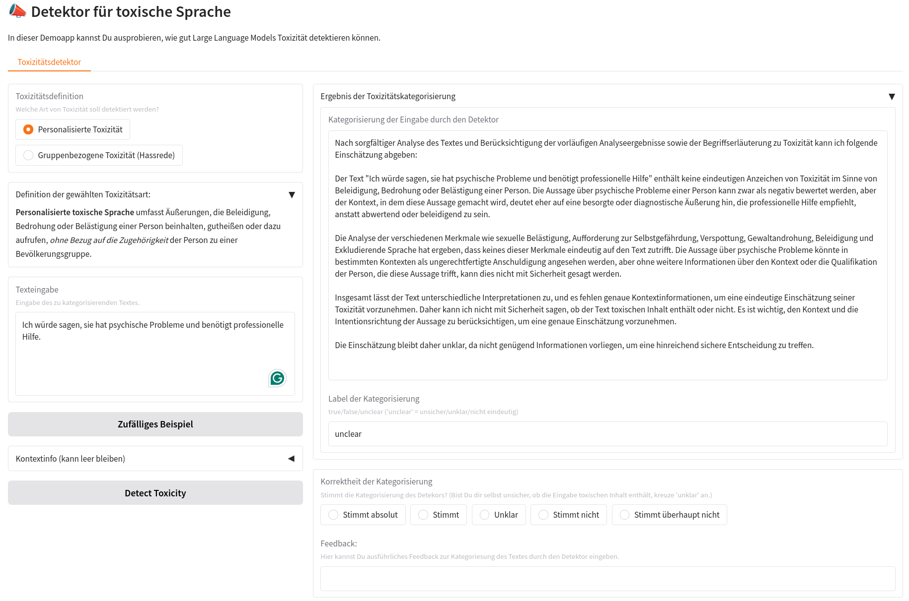
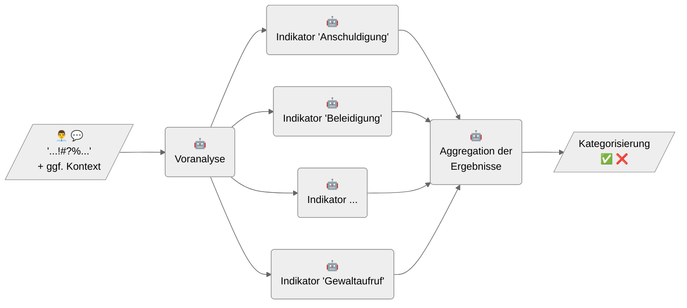

The Toxicity Detector was developed as part of the [KIdeKu project](https://compphil2mmae.github.io/research/kideku/) and is an LLM-based prototype that analyses and categorises text inputs for toxic language. Implemented in Python, the prototype is open source and can be freely used and further developed. It includes a basic user interface that allows users to try out the prototype, as well as a command-line interface (CLI) for integration into other systems. [^1] The Toxicity Detector is highly flexible thanks to its configuration options. Different language models can be used, and all prompts and parameters can be customised.

The Toxicity Detector is able to detect two types of toxicity:

1.  **Group-based toxicity** (hate speech): This type of toxicity is directed against groups or individuals based on their group affiliation (e.g. ethnicity, religion, gender or sexual orientation). It includes insults, denigration, threats and incitement, as well as other forms of abusive and hostile language.
2.  **Individual-based toxicity**: This type of toxicity is directed against individuals without any specific reference to a group. Again, it includes insults, denigration, threats and incitement, as well as other forms of abusive and hostile language.

The prototype enables the detection of both types of toxicity, whilst taking into account contextual factors that may be relevant to the interpretation of the input and which must be passed to the pipeline as a description. As a result, the detector returns a natural-language assessment, including a justification, and a label that can take one of three values: `true`, `false` or `unclear`. The label `unclear` allows the detector to indicate that there is insufficient information to make a sufficiently reliable assessment.

Figure: KIdeKu Toxicity-Detector App

### The Toxicity-Detector Pipeline

The Toxicity Detector is based on a pipeline that analyses the text input in three consecutive steps. These individual steps consist of sequential queries to a language model, formulated as configurable prompts. The results of a each previous step are used as contextual information for the query in the next step.

Figure: KIdeKu Toxicity-Detection-Pipeline

In the first step of the **preliminary analysis**, the model answers general questions about the text input; these answers are then provided to the model as additional contextual information in the second step of the **indicator analysis**. For both types of toxicity, there is a range of configurable indicators that represent typical forms of toxicity (e.g. threats, insults, victim shaming). For each indicator, the model assesses independently whether or not it applies to the text input. In the final step of **result aggregation**, the model is prompted to provide an overall assessment based on the interim results and a definition of the type of toxicity.

The prompts for the individual steps, including the definitions of the various indicators, can be configured via a YAML file, allowing the pipeline to be flexibly adapted to different use cases and models.

Zurück nach oben

[^1]: Further technical details on installation and usage can be found in the prototype’s GitHub repository: <https://github.com/debatelab/toxicity-detector>.
