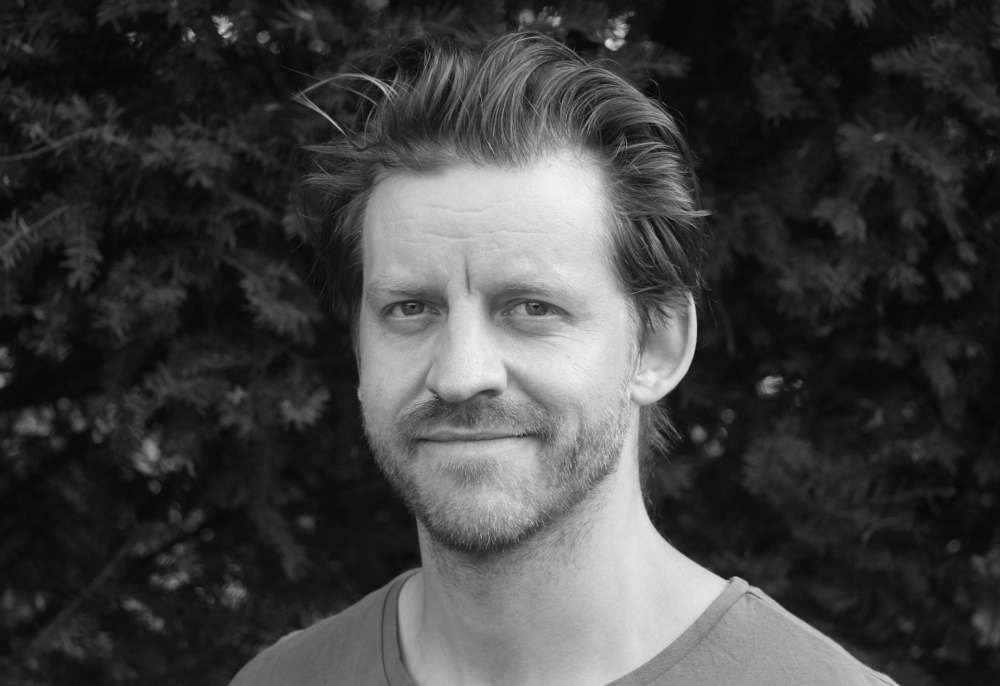

# Sebastian Cacean

Argumentation Theory · AI · Education

    

I am a researcher and educator with a focus on argumentation theory and applied ethics. My **research** leverages methods from argumentation theory and content analysis to study argumentative texts ranging from philosophical writing to public discourse. My **teaching** focuses on analytical methods for understanding and analysing argumentation. I am also passionate about exploring how large language models (LLMs) can assist in identifying, reconstructing, and analysing arguments, and more broadly, how they can support research and teaching in argumentation.

[Learn more about me →](about.llms.md)

Back to top
