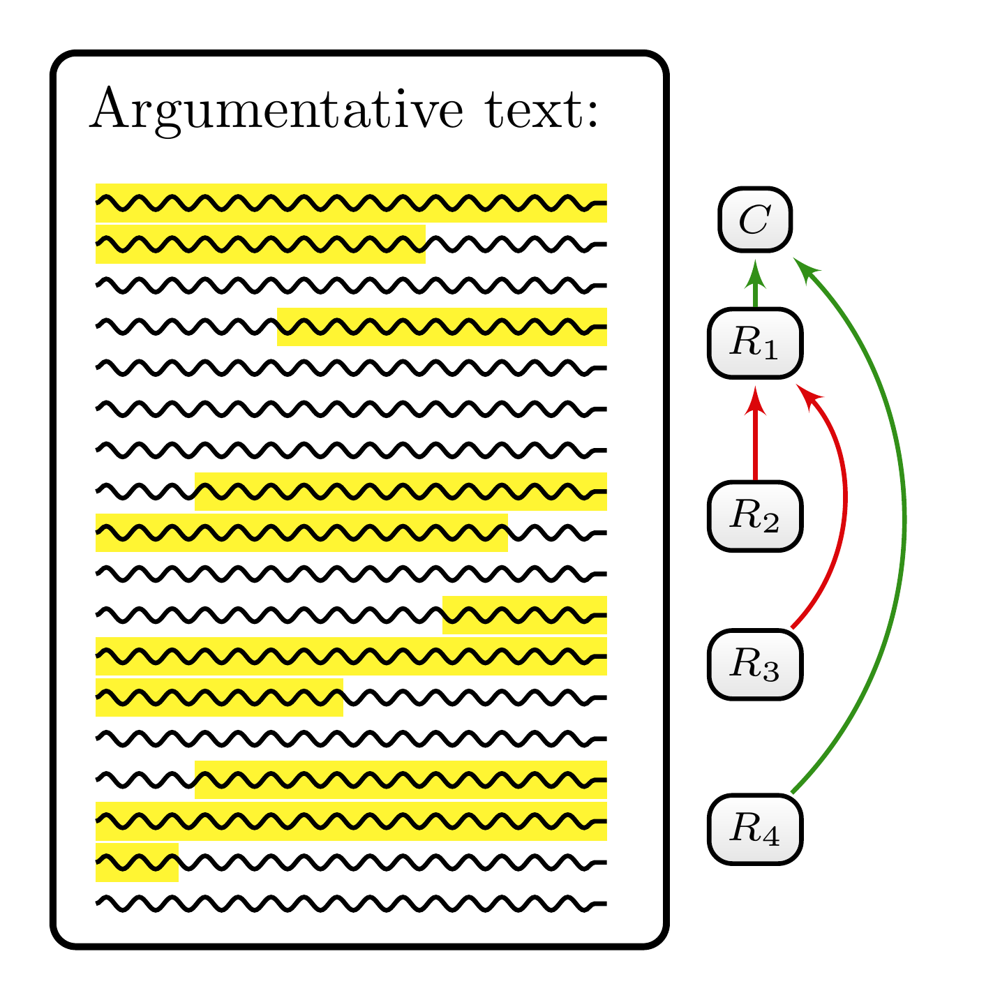

`MAnnoSAS` is a **m**inimalistic **anno**tation **s**cheme for analysing **a**rgumentation **s**tructures focusing on inter-annotator reliability. I designed this annotation manual as part of my PhD project, and it is now published under a Creative Commons license for everyone to use. Although the manual instructs annotators in analysing argumentative texts, it can also serve as an introduction to argument mapping. You can find the HTML version of the manual [here](https://sebastiancacean.de/mannosas/).

[](fig-annot-guidelines-03.png "Figure 1: A schematic example of annotating the argumentation structure of a text. There are five argumentative units: The first one represents the main claim (C), which is supported by two reasons that are formulated by the second (R_1) and the fifth text segment (R_4). Both the third (R_2) and the fourth text segment (R_3) represent reasons against—that is, objections to the supporting reason R_1.")

Figure 1: A schematic example of annotating the argumentation structure of a text. There are five argumentative units: The first one represents the main claim (\\C\\), which is supported by two reasons that are formulated by the second (\\R_1\\) and the fifth text segment (\\R_4\\). Both the third (\\R_2\\) and the fourth text segment (\\R_3\\) represent reasons against—that is, objections to the supporting reason \\R_1\\.

Let’s unpack the concepts and features of `MAnnoSAS` step by step.

**First, what is this guideline supposed to be used for?** In short, it explains and provides numerous hints to analyse the argumentation structure in argumentative texts, that is texts including argumentation. Typically, argumentative texts contain claims, reasons, arguments, objections, and refutations. The term *argumentative component* will be used as an umbrella term for these elements.

Argumentative components are usually related to each other by argumentative relations. For instance, an argument is always an argument *in favour* of some statement, which might be the main claim or the premise of another argument. In this way, an argument can support a claim or another argument. Similarly, an objection is always an objection *against* some statement. This relation will be referred to as an attack relation.

The argumentation structure of an argumentative text refers to the set of the text’s expressed argumentative components together with the different argumentative relations between them. This structure can be visualised using a reason map. [Figure 1](#fig-reason-map) is a schematic example of a text in which argumentative components are annotated and where the resulting argumentation structure is visualised as a reason map.

**Second, why do we need an annotation scheme?** In principle, you do not need a manual to understand the argumentation structure in a text. As competent speakers, we are sufficiently capable of identifying argumentative components and their inter-relationships. However, `MAnnoSAS` is designed for socio-empirical research contexts. For instance, a scientist might want to analyse parliamentary debates by counting arguments in different speeches. These contexts impose certain scientific criteria on analysts. Ideally, analysing the structure of argumentation would be like a measurement process: concepts and instructions must be precise enough to yield unique results. `MAnnoSAS` does not provide this ideal precision but helps make analysis results more reliable and comparable across analysts. This analogy leads to the next question.

**Third, what is inter-annotator reliability and why does it matter?** Inter-annotator reliability is a measure of the degree to which different annotators agree in their analysis. This form of reliability is important in scientific contexts, as it amounts to a form of objectivity, or at least intersubjectivity. If we are, for instance, interested in counting the number of argumentative components in a text, we want to be sure that different analysts will come to the same result. If the result varies across analysts, we do not know whether it reflects a property of the text or is an artefact of the particular analyst.

The criterion of inter-annotator reliability is challenging to meet in argumentation analysis. The analysis of argumentation structure is an interpretive process that can yield divergent results among analysts. The annotator must, for instance, decide whether a text segment is a justificatory reason for a claim or a mere explanatory reason without justificatory relevance. The difference between these two types of reasons is often subtle and requires interpretation. In other cases, the annotator must decide whether a text segment is one compound reason or two separate reasons. Some cases are not clear-cut and require interpretation. `MAnnoSAS` is tailored to help analysts achieve the same results by providing definitions of key concepts and guidance on their application. While it cannot guarantee uniqueness, its goal is to reduce interpretation and to increase inter-annotator reliability.

**Fourth, in which way is this annotation scheme minimalistic?** Argumentation analysis is a complex task. There are many ambitious theories and approaches to argumentation analysis, which usually involve reconstructing arguments in premise-conclusion form. Applying these approaches requires expertise and experience. `MAnnoSAS` is designed to avoid these demanding requirements. It can instruct analysts with no prior knowledge of argumentation theory. It is minimalistic to the extent that it introduces comparably few concepts and avoids overly sophisticated theoretical baggage. In particular, it does not require analysts to reconstruct arguments in their premise-conclusion form. Instead, it focuses on identifying argumentative components and their interrelationships. The goal is to provide a guideline that is easy to use and that allows for reliable identification of argumentative components in text.

If this sounds useful for your own work, I invite you to try `MAnnoSAS` on a short argumentative text and see how far the guideline takes you. Its purpose is not to eliminate interpretation altogether, but to make analytical decisions clearer, more consistent, and easier to compare across annotators. I hope the manual supports both teaching and research, and I would be very happy to hear about applications, adaptations, or critical feedback.

Back to top

## Reuse

[CC BY 4.0](https://creativecommons.org/licenses/by/4.0/)

## Citation

BibTeX citation:

``` quarto-appendix-bibtex
@online{cacean2026,
  author = {Cacean, Sebastian},
  title = {🔎 {MAnnoSAS}},
  date = {2026-10-01},
  url = {https://sebastiancacean.de/posts/mannosas/},
  langid = {en}
}
```

For attribution, please cite this work as:

Cacean, Sebastian. 2026. “🔎 MAnnoSAS.” October 1. <https://sebastiancacean.de/posts/mannosas/>.
