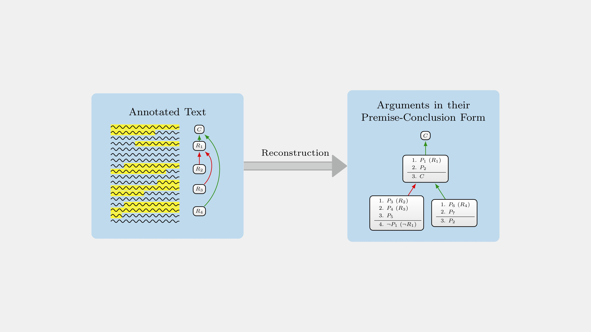
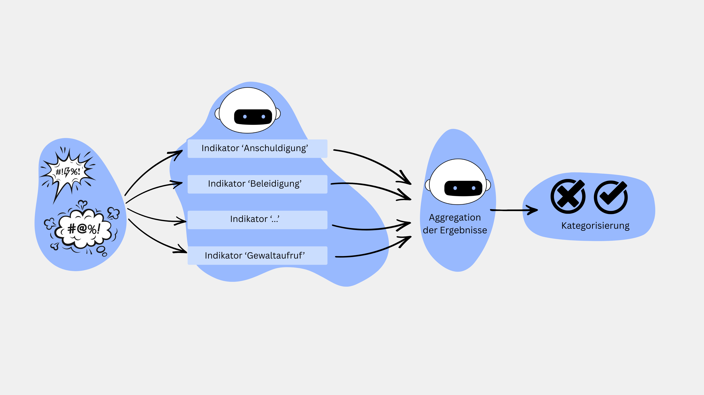

# Projects

This portfolio includes works, software, and tools I have contributed to or designed,  
along with openly available educational material I have created.

Author

Sebastian Cacean

##### Argumentative Content Analysis

Argumentative Content Analysis is a research method to analyse argumentation by identifying argumentative components and their relations in texts.

Sep 1, 2026

##### Evidence Seeker

A code template for building customised LLM-based fact-checkers.

Dec 12, 2025

##### Toxicity Detector

An LLM-based pipeline to detect toxic speech.

Jan 12, 2026

Back to top
