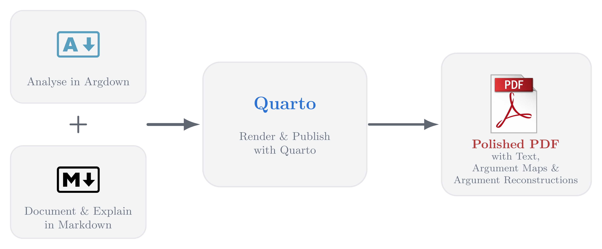

<!--
1. What is Argdown? What is it used for?
2. Argdown in workflows & the role of commented Argdown maps. (Usually you do not have bare reconstructions). Possibilities
    + Markdown in Argdown Documents
    + Separate Documents
    + Argdown source blocks in Markdown
3. Rendering beautiful Document with Quarto
    + What is Quarto
4. The Template: Usage of the template
-->

Argdown is great for representing argumentation structures. But what if you want to do more than represent the structure?

When analysing an argumentative text, you may want to document interpretational decisions, preserve alternative reconstructions, quote and reference the source text, and add notes explaining your analysis. And when presenting the analysis to others, you may want to combine argument maps with prose, argument reconstructions, quotations, and a larger narrative.

This is where Markdown and Quarto come in. In this post, I show how Markdown documents containing Argdown source blocks can be used to document and present argumentation analyses, and introduce a template for turning them into polished PDFs with Quarto.



Argdown is a simple syntax used to describe arguments, their internal premise-conclusion structure and argumentative support and attack relations between arguments. Since Argdown is machine-readable, Argdown documents can easily be used to automatically generate argument maps, visualising the relationships between arguments as a graph. 

@argdown-snippet-1 depicts a small Argdown snippet that describes a schematic macrostructure of four arguments. By clicking on the "map" button, you can see the argument map generated from this Argdown snippet. 

::: {#argdown-snippet-1}

```argdown
[Main claim]: Main claim, justified or criticised by arguments. #pro
    + <1. Argument>: Argument supporting the main claim. #pro
    + <2. Argument>: Another argument supporting the main claim. #pro
    - <3. Argument (objection)>: Argument formulating an objection 
    to the main claim. #con
        - <4. Argument (rebuttal)>: Argument rebutting the objection. #pro
```

Simple macrostructure of four arguments and their relationships.

:::

In this way, Argdown files can represent both the internal structure of individual arguments and the argumentative relations between them.

However, the mere argumentation structure is often only one piece within the larger context of how that structure serves a specific end. Two very important and connected use cases are the following:

1. **Process of argumentation analysis:** Suppose you want to understand the argumentation in an argumentative text better. Using tools from logic and argumentation theory, you reconstruct the arguments you identified in the text in their premise-conclusion structure and analyse their relationships. Argumentation analysis is rarely a matter of simply identifying a fixed structure that is already apparent in the text. It is an interpretative process that often involves competing reconstructions, revision cycles, and decisions that are not self-explanatory. Accordingly, it is advisable to document your analysis in a way that is easy to share with others and that allows you to update your analysis as you revise your understanding of the text. To that end, you should explain your interpretational decisions, take notes about alternative interpretations, document references to the text, provide textual evidence and so on.
2. **Presenting analyses of argumentation:** Suppose you want to present your analysis of an argumentative text to others, for instance, to share your insights or to support your own claims based on your analysis. Simply providing the audience with the result of your analysis, that is, the resulting argumentation structure (either as an Argdown file or as an argument map), is usually not enough. While an argument map shows the argumentation structure, it does not necessarily explain why the analysis takes this form. You want to present your analysis in a way that is easy to understand, and that allows the audience to follow your reasoning. This usually requires a combination of text, argument reconstructions and argument maps. For instance, you might want to add explanatory comments on specific arguments by, for instance, explaining the relevance of a specific premise, or you might want to add a summary of some arguments and their role, or you might even want to embed the analysed argumentation in a larger narrative.

In both cases, the mere argumentation structure is only one of many pieces. You need to complement the structural information with additional, often unstructured information.

There are several ways to organise this additional context information. For instance, you could create separate documents that contain this additional information and add references to your argumentation analysis. Or you can add this information directly to the Argdown file as [comments](https://argdown.org/syntax/#comments), or by using [Markdown syntax in the Argdown file](https://argdown.org/#_3-markdown-like-text-formatting), or even as [YAML data](https://argdown.org/syntax/#argument-yaml-data). 

These options are useful especially for the first use case. However, it can get a little bit cumbersome if the context information is extensive. For the second use case, however, these options are usually not very suitable. In particular, Argdown files are not designed for the purpose of creating polished documents that combine text, argument reconstructions and argument maps. A much more promising approach is to use [Markdown documents that include Argdown source blocks](https://argdown.org/guide/using-argdown-in-markdown.html). In this way, you can combine the advantages of Argdown files for argumentation analysis with the advantages of Markdown documents:

+ **Centralised narrative context:** combine argument reconstructions with prose explanations, quotations, notes, and references in one single file.
+ **Versioning and sharing:** keep the analysis and its documentation in a plain-text file that can be easily shared and versioned (e.g., via `git`).
+ **Editor independence:** use any Markdown editor of your choice to write and edit the document.
+ **Separation of content and presentation:** write the analysis in Markdown syntax while leaving typography and PDF layout to rendering tools (e.g., Quarto/Pandoc).

The last point is particularly important for the second use case. While Argdown files can be rendered to HTML documents and argument maps, they are not very suitable for creating polished PDF documents. In this post, I will focus on using Quarto. 

[Quarto](https://quarto.org) is a publishing system for creating reproducible documents and websites from plain-text source files. It supports multiple output formats, including HTML, PDF, and Word, and integrates naturally with Markdown, Pandoc, and computational content.

Quarto documents are written in Pandoc Markdown syntax, a Markdown flavour that has been extended with some additional features. Together with the [Argdown Pandoc filter](https://argdown.org/guide/publishing-argdown-markdown-with-pandoc.html), Quarto allows you to create documents that combine text, argument reconstructions and argument maps in a single file by using Argdown source blocks.^[You can find a schematic example of such a document in the template repository: [Example Quarto document](https://github.com/xylomorph/argdown-quarto-pdf-template/blob/main/example-doc.qmd).] Argument maps will be automatically generated from the Argdown source blocks and included in the rendered document. Similarly, you can include Argdown source blocks displaying, for instance, argument reconstructions that will receive syntax highlighting in the rendered document. 

This is a very powerful approach ready at your fingertips. The only downside is that it requires a slightly nerdy setup. To make this workflow easier to adopt, I created a GitHub template that guides you through installation and handles most of the configuration needed to turn a Quarto document with Argdown source blocks into a polished PDF.

The template is available on GitHub at [github.com/xylomorph/argdown-quarto-pdf-template](https://github.com/xylomorph/argdown-quarto-pdf-template). There, you will find a detailed description of how to use the template and set up your environment. In a nutshell: 

1. Download the template from GitHub or use it as a template for your own repository.
2. Install Quarto and the Argdown Pandoc filter.
3. Create a Markdown document with Argdown source blocks and add your content.
4. Render the document to PDF using Quarto.

The resulting workflow is therefore quite simple:

1. Analyse in Argdown 
2. Document and explain in Markdown 
3. Render and publish with Quarto.