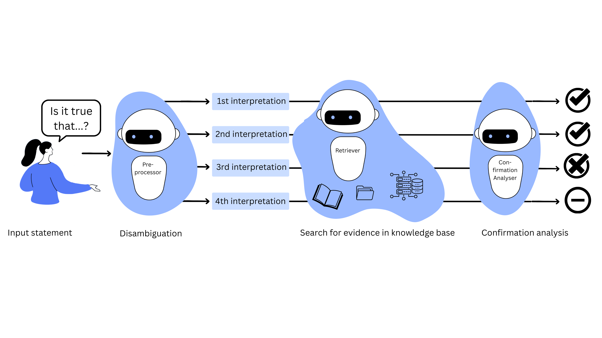

<!--
🤗 Gradio DemoApp: <https://huggingface.co/spaces/DebateLabKIT/evidence-seeker-demo>
 [EvidenceSeeker Portal](https://evidence-seeker.philosophie.kit.edu/)

-->

*EvidenceSeeker Boilerplate* is a Python code template that can be used to set up LLM-based fact-checking tools, which are called _EvidenceSeekers_. Each _EvidenceSeeker_ relies on a provided knowledge base to fact-check input statements. For each input statement, the _EvidenceSeeker_ searches for confirming and debunking information in the knowledge base and aggregates the found evidence. 

An EvidenceSeeker uses a pipeline with three main components:

1. **Preprocessor**: The preprocessor disambiguates the input statement by identifying different interpretations.
2. **Retriever**: The retriever searches for *potential evidence* in the knowlege base by identifying relevant data (i.e., semantically similar) to the identified interpretations.
3. **Confirmation Analysis**: The confirmation analyser decides for each potential piece of evidence the degree to which it confirms or debunks an identified interpretation. Finally, the confirmation analyser aggregates the found evidence for each identified interpretation to an overall degree of confirmation.

